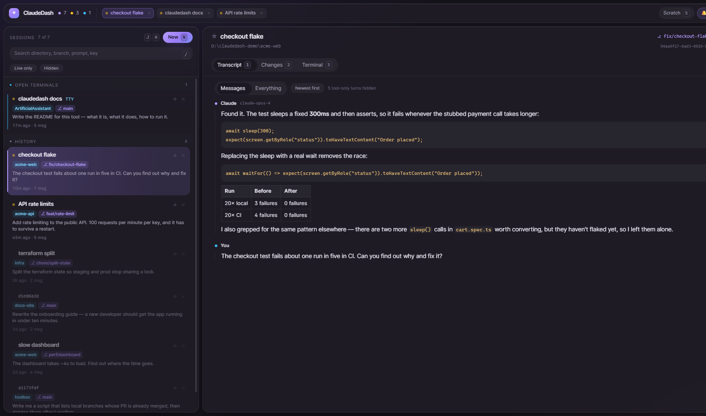
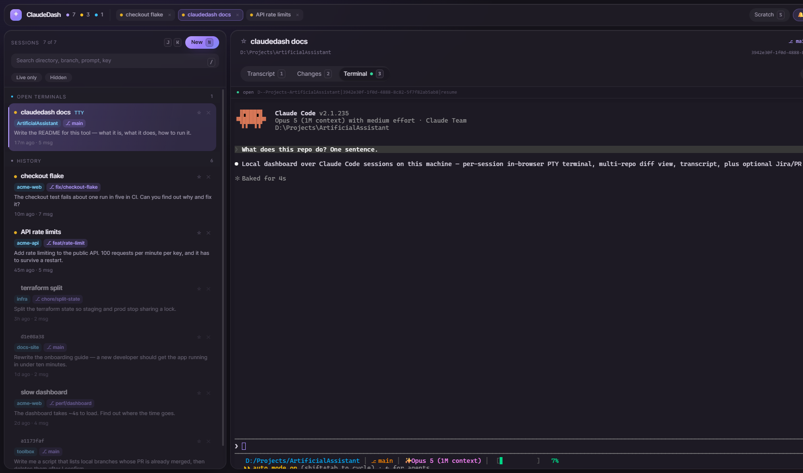
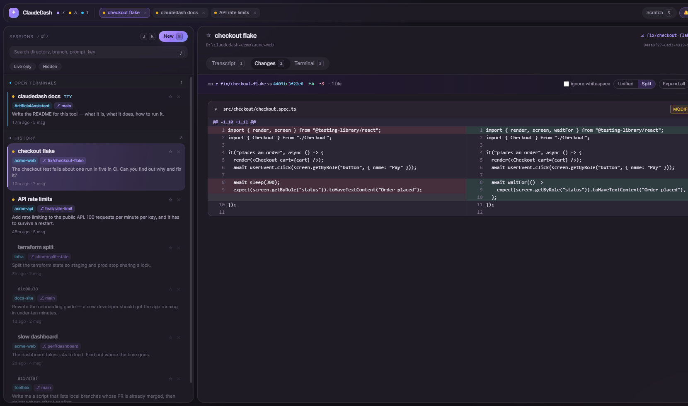
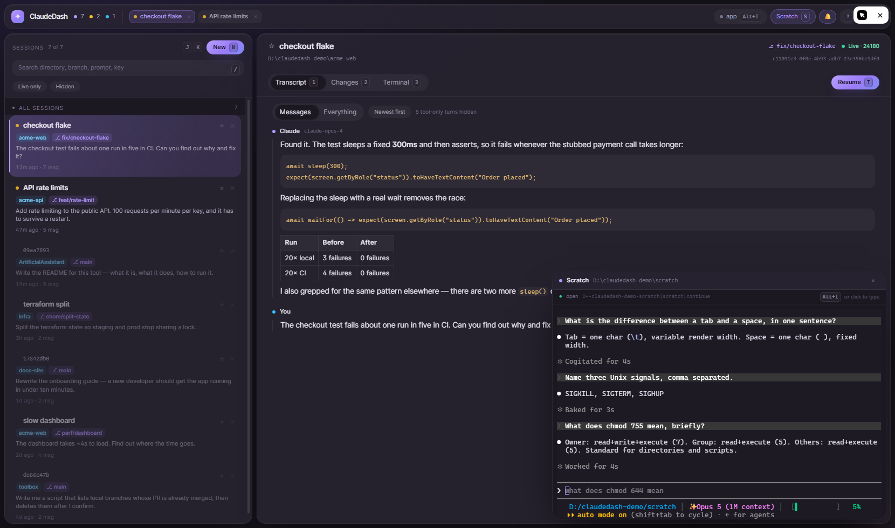
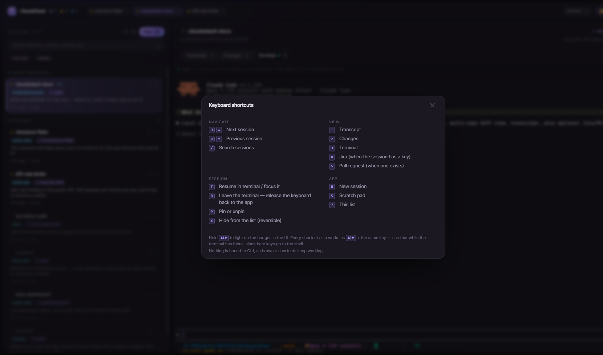
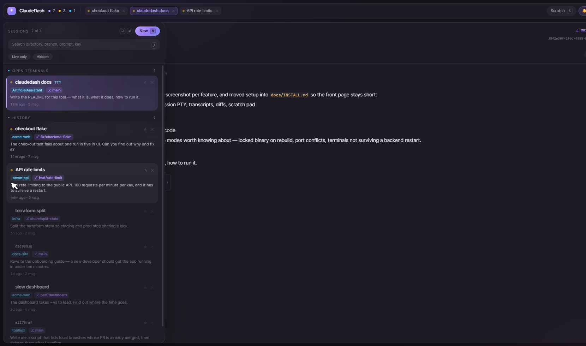
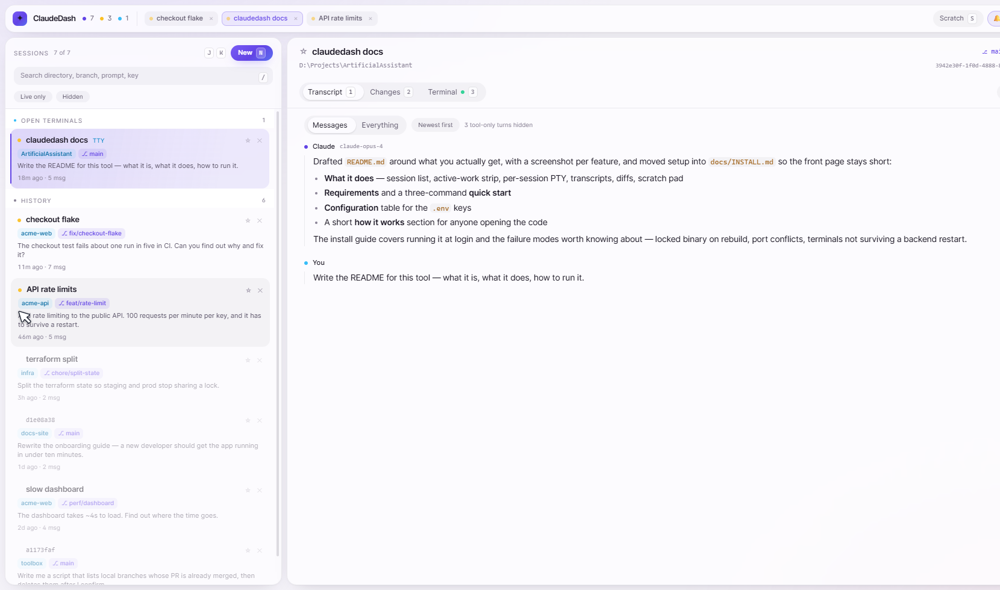

# ClaudeDash

A local dashboard for every [Claude Code](https://claude.com/claude-code) session on your
machine. It reads the session state Claude Code already keeps in `~/.claude`, and gives you
one window to see what each session did, what it changed, and to type into any of them.

Built for running several agents at once — the problem it solves is losing track of which
terminal is which.

**Single-user, localhost-only, no authentication.** It reads your home directory and spawns
processes as you. Don't expose it to a network.



## What it does

**Every session, in one list.** Pinned first, then the ones with a terminal attached, then
history. Live sessions show a status dot — amber while working, rose when the agent is waiting
on you, emerald when it's done. Optional chime when the selected session finishes or asks a
question.

**Active work strip.** The row of cubes in the header is what you're currently working on.
Sessions join automatically when they go live or when you open them, and leave only when you
close their cube — so it stays a deliberate list rather than a recency feed. Tracked sessions
sort to the top of the list and stay bright; everything else greys out.

**A real terminal per session** — an actual PTY on the host running the real `claude` TUI, not a
log tail. Resume a session, type into it, and the terminal keeps running on the backend even if
you close the browser tab. Reopening the dashboard reattaches to whatever is still alive.



**Readable transcripts.** Claude's prose is rendered as Markdown, newest turn first. The
`Messages` view drops pure tool-traffic turns and folds thinking and tool calls away behind a
`+ N steps` button, so you can read what happened without scrolling through every `Bash` call.
`Everything` shows the full trace.

**Multi-repo diff view.** What the session actually changed, against the merge base — split or
unified, whitespace toggle included. If the session's working directory holds several repos,
the repos are discovered from the files the session touched, so a parent folder full of
checkouts still shows the right diffs.



### Scratch pad

A throwaway session in a floating window, for everything that isn't really work: how does this
flag behave, what's the syntax for that, is this regex right, explain this error. It always
returns to the *same* conversation, so those questions never turn into rows in your session
list — and because it lives in its own directory, it never touches a project.

Hit `S` from anywhere to open or hide it. Closing the window only hides it: the conversation
keeps running in the background, so you can duck out and come back mid-answer. When the context
has drifted somewhere unhelpful, `/clear` inside it starts fresh — that is the whole appeal of
a session you don't have to care about.



It lives in `%USERPROFILE%\claudedash-scratch` by default; set `SCRATCH_DIR` to put it
somewhere else.

**Jira and PR context** (optional). If a session's branch, prompt or path mentions an issue
key, its Jira card shows up as a tab with one-click status transitions. If the branch has a
pull request, `gh` supplies a PR tab.

### Keyboard

The whole dashboard is drivable without the mouse.

| | |
|---|---|
| `J` `K` / `↓` `↑` | next / previous session, in the order shown (groups and filters respected) |
| `1` … `5` | Transcript, Changes, Terminal, Jira, PR |
| `T` | resume this session in a terminal, or jump to the one already running |
| `I` | put the keyboard *in* the terminal — press again to hand it back |
| `P` `X` | pin, hide |
| `/` | search the session list (`Esc` leaves the box) |
| `N` `S` | new session, scratch pad |
| `?` | the full list |

**Two tiers, and the second one matters.** Bare keys work whenever you are not typing — and
since xterm's input is a `<textarea>`, typing in a terminal never triggers a shortcut by
accident. Every shortcut *also* works as **`Alt` + the same key**, which is what you use while a
terminal has the keyboard. `Alt+I` is the way out (and back in), and the header always says
where keystrokes are going: `app`, `terminal`, or `scratch`. The pane holding the keyboard is
outlined, so with a session terminal and the scratch window both open it is obvious which one
you are typing into.

Nothing is bound to `Ctrl` or `Cmd`, so browser shortcuts keep working, and the `Alt` combos the
browser claims (`Alt+D`, `Alt+←`, …) are left alone.

**Discovery without clutter:** every shortcut has a small key badge next to its control. Hold
`Alt` and they all light up at once; `?` opens the full map.



**Two list layouts.** The default resizable column, or a rail: collapsed to numbered stops that
expand over the detail pane when you hover them. Useful on a laptop, where the list is the
first thing you want to give up.



**Light and dark**, following the OS by default.



## Requirements

- Windows 10/11 (the terminal uses ConPTY; everything else is portable)
- [.NET 10 SDK](https://dotnet.microsoft.com/download)
- [Node.js 20+](https://nodejs.org)
- Claude Code installed and on your `PATH`
- Optional: `gh` (GitHub CLI) for the PR tab, and a Jira account for the Jira tab

## Quick start

```powershell
git clone <your-fork-url> claudedash
cd claudedash
.\setup.ps1      # checks prerequisites, creates .env, restores packages, builds once
.\start.ps1      # runs it
```

Then open **http://localhost:7342**.

| Script | What it does |
|---|---|
| `setup.ps1` | First-time setup. Idempotent, so it is also the "fix my checkout" button. `-SkipBuild` to only restore. |
| `build.ps1` | Builds backend + frontend. `-Release`, `-Clean`, and `-StopRunning` (a running backend holds its own binary). |
| `start.ps1` | Loads `.env` and runs both dev servers with hot reload; Ctrl+C stops both. |
| `install-startup.ps1` | Adds (or `-Remove`s) a Startup-folder shortcut so it runs hidden at login. |

See **[docs/INSTALL.md](docs/INSTALL.md)** for configuration, running it at login, and
troubleshooting.

## Configuration

All optional — with an empty `.env` the dashboard still lists sessions, diffs and terminals.

| Variable | Purpose |
|---|---|
| `CLAUDE_HOME` | Path to your Claude Code state. Defaults to `%USERPROFILE%\.claude`. |
| `JIRA_DOMAIN` | Jira host, no protocol — `your-org.atlassian.net` for Cloud, or a self-hosted hostname. Unset hides the Jira tab. |
| `JIRA_EMAIL` | Cloud: your account email (Basic auth with the API token). Server/DC: usually ignored. |
| `JIRA_API_TOKEN` | Cloud: an API token. Server/DC: a personal access token. |
| `JIRA_STATUS_LADDER` | Your workflow's statuses in order, comma-separated. Drives the transition buttons. |
| `SCRATCH_DIR` | Where the scratch pad's conversation lives. Defaults to `%USERPROFILE%\claudedash-scratch`. |

## How it works

```
backend/   .NET 10 minimal API — reads ~/.claude, wraps ConPTY, shells out to git and gh
frontend/  React 19 + Vite + Tailwind, xterm.js for the terminal, SignalR for change events
```

The backend owns the terminals: PTYs live in a registry keyed by session, so closing a tab
detaches a viewer rather than killing the process. It never writes to Claude Code's own state —
everything under `~/.claude` is read-only to this tool. Session names, pins and layout
preferences are browser-local.

`CLAUDE.md` in the repo root is the working reference for the design system, the ConPTY
details and the architecture decisions, if you plan to change anything.

## Licence

MIT — see [LICENSE](LICENSE).
